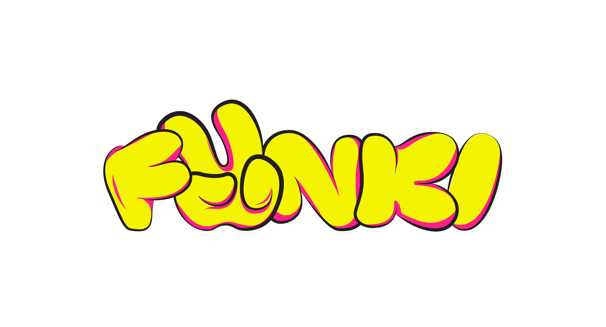

# Funki brand-kit

This repo contains a fonts, logos and symbols for the Funki brand.

Funki is a secure, affordable, and developer-friendly Ethereum L2 designed to onboard the next billion users to the blockchain. We are committed to decentralization as a means to foster an open, worldwide cryptoeconomy that is accessible to all. It's built on Optimism’s open-source [OP Stack](https://stack.optimism.io/).

<!-- Badge row 1 - status -->

<!-- Badge row 2 - links and profiles -->

<!-- Badge row 3 - detailed status -->

### Fonts

Located in [/fonts](fonts/).

### Logos

### Symbols

| Symbol                                                       |
| ------------------------------------------------------------ |
|                |
|                |
|              |
|              |
|  |
